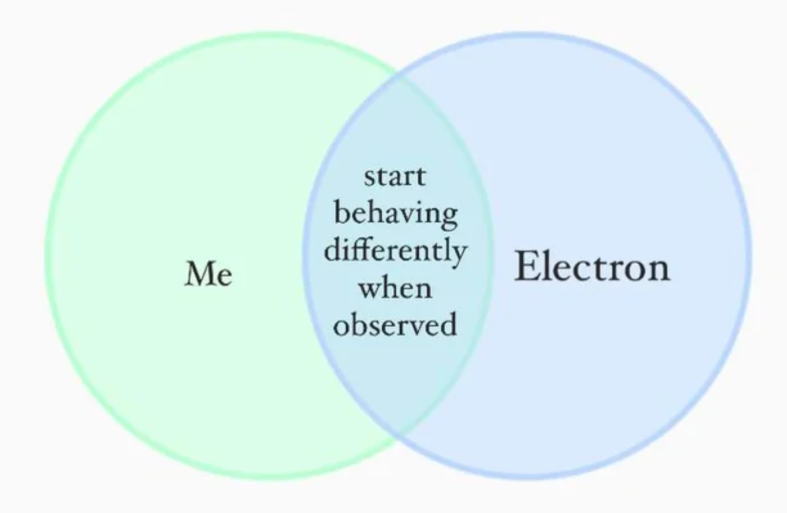
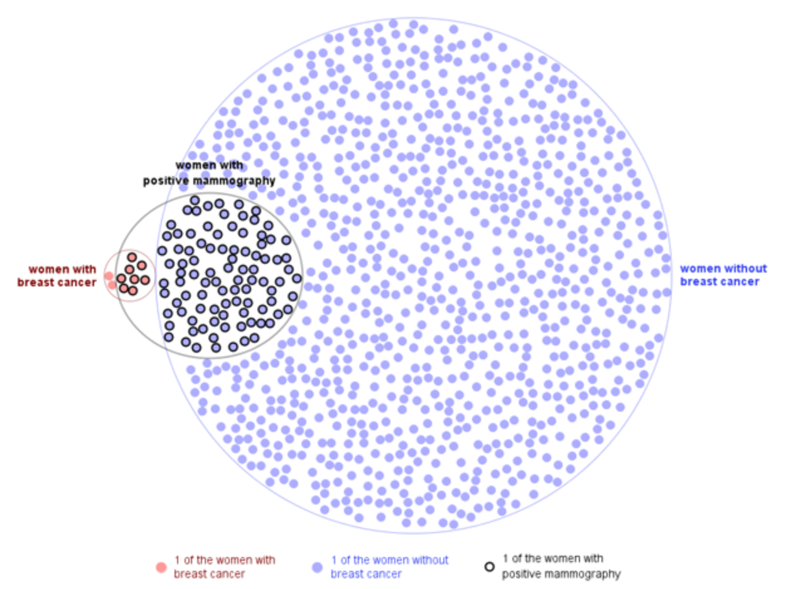
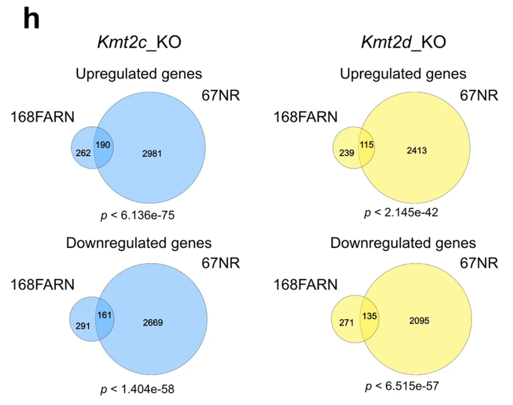

# Venndir Gallery

## Figure Boosting

One of the best hobby activities while developing Venndir has been
"figure sniping", which is loosely translated,
"Can Venndir make that figure?"

There are two main motivations:

1. Can it be done? *A test of creativity, a test of wills.*
2. Can it be done better? *Dare we try?*

There are plenty of graphics tools with which someone could just
create their own Venn diagram "by hand", such as Inkscape,
Adobe Illustrator, Microsoft Powerpoint.
For me, the fewer things I do "by hand" the better.
To be completely frank with myself, the fewer things I don't *want*
to do by hand the better.
Also me: Somtimes I do what I *want* to do.

The first example was shown in Figure \@ref(fig:items-2),
to recreate part of the nice Venn diagram in [@Salybekov_2021] Figure 2.


### Me - Electron

This example is straighforward, starting with a fun one posted on Reddit
[r/physicsmemes](https://www.reddit.com/r/physicsmemes/comments/v5adqq/you_and_i_arent_so_different/).
The person "Me" and an "Electron" both starts behaving differently
when observed.

The labels are clear, the colors are easily approximated.
The font looks like Times, so `fontfamily='serif'` should suffice.
The center label is probably best represented as one item label,
separating each word with a newline `'\n'` character.

Figure \@ref(fig:me-electron) shows the outcome, relatively quick and easy!
Two more options are shown on the bottom row. The first (bottom left)
customizes the innerborder and outerborder. The second calls
`modify_venndir_overlap()` to highlight the center region.

(ref:me-electron) Figure from Reddit r/physicsmemes (top left), re-created by Venndir (top right). Two alternatives are shown (bottom row) adding some visual flair.

```{r me-electron, out.width="50%", fig.show="hold", fig.ncol=2, echo=FALSE, fig.width=7, fig.height=5, fig.cap="(ref:me-electron)", fig.alt="(ref:me-electron)", fig.subcap=c("Source figure.", "Re-creation.", "Alternate 1.", "Alternate 2.")}

olist <- c("Me",
   "Electron",
   paste(collapse="\n",
      c("start",
         "behaving",
         "differently",
         "when",
         "observed"))
)
k <- 0.02;
vo <- venn_meme(olist,
   outerborder.lwd=1.5,
   innerborder.lwd=1.5,
   poly_alpha=0.7,
   expand_fraction=c(-0.1 - k, -0.1, -0.1 + k, -0.1)*2.4,
   item_cex_factor=c(0.8, 0.85, 0.9),
   fontfamily="serif",
   set_colors=c("#BFFAD6", "#C4D8F6"))

# fun alternate #3
k <- 0.02;
vo3 <- venn_meme(olist,
   outerborder.lwd=5, outerborder="#F5F5F7FF",
   innerborder.lwd=0.5,# innerborder="#88888833",
   border="#77777755", border.lwd=0,
   poly_alpha=0.7,
   xyratio=1,
   expand_fraction=c(-0.1 - k, -0.1, -0.1 + k, -0.1)*2.4,
   item_cex_factor=c(0.8*1.2, 0.85, 0.9)*1.2,
   # fontfamily="AndrewScript",
   fontfamily="Bradley Hand",
   set_colors=c("#BFFAD6", "#C4D8F6"))

# fun alternate #4
olist4 <- olist;
olist4[1:2] <- paste0("{.gothic ", olist4[1:2], "}");
ms <- list(
   gothic=marquee::style(
      family="AcademyEngravedLetPlain",
      weight="normal", width="normal"))

vo4 <- venn_meme(olist4,
   do_plot=FALSE,
   marquee_styles=ms,
   outerborder.lwd=5, outerborder="#F5F5F7FF",
   innerborder.lwd=0.5,# innerborder="#88888833",
   border="#77777755", border.lwd=0,
   poly_alpha=0.7,
   xyratio=1,
   expand_fraction=c(-0.1 - k, -0.1, -0.1 + k, -0.1)*2.4,
   item_cex_factor=c(0.8*1.2, 0.85, 0.9)*1.2,
   fontfamily="AndrewScript",
   # fontfamily="Allura",
   set_colors=c("#BFFAD6", "#C4D8F6"))
vo4 <- modify_venndir_overlap(vo4,
   overlap_set="A&B",
   params=list(outerborder="#B3ECEF", outerborder.lwd=5,
      innerborder="#E0FFFF", innerborder.lwd=5))
vo4 <- modify_venndir_overlap(vo4,
   overlap_set="A",
   params=list(innerborder="#BFFAD6",
      innerborder.lwd=2, outerborder.lwd=0))
vo4 <- modify_venndir_overlap(vo4,
   overlap_set="B",
   params=list(innerborder="#C4D8F6",
      innerborder.lwd=2, outerborder.lwd=0, border=0))
k <- 0.02;
plot(vo4,
   # fontfamily="Allura",
   fontfamily="La Parisienne Script",
   item_cex_factor=c(0.8*2.5, 0.85*1.3, 1.0)*1.2,
   expand_fraction=c(-0.1 - k, -0.1, -0.1 + k, -0.1)*2.4)


```

```{r me-electron-show, eval=FALSE, fig.width=7, fig.height=6, fig.cap="(ref:me-electron)", fig.alt="(ref:me-electron)"}
olist <- c("Me",
   "Electron",
   paste(collapse="\n",
      c("start", "behaving",
         "differently", "when",
         "observed"))
)
venn_meme(olist,
   outerborder.lwd=2, innerborder.lwd=2,
   poly_alpha=0.7,
   expand_fraction=c(-0.1, -0.1, -0.1, -0.1),
   item_cex_factor=c(0.8, 0.8, 0.9),
   fontfamily="serif",
   set_colors=c("#BFFAD6", "#C4D8F6"))
```


### eulerGlyphs

(ref:eulerglyph) Target diagram from eulerGlyphs.

```{r eulerglyph, echo=FALSE, out.width="90%", fig.cap="(ref:eulerglyph)", fig.alt="(ref:eulerglyph)"}

```

Figure \@ref(fig:eulerglyph) shows a fantastic figure created by
[eulerGlyphs](https://www.eulerdiagrams.com/eulerGlyphs/),
an application designed to create proportional Euler diagrams.
The data represents [breast cancer screening statistics](10.1109/TVCG.2012.199),
and is a common reference dataset to study the visual perception of statistics.

A brief summary of the data follows:

* 10 out of 1,000 women age 40 have breast cancer.
* 8 of every10 women *with* breast cancer got a positive test result.
* 95 of every 990 women *without* breast cancer got a positive test result.

Figure \@ref(fig:euler-glyphs-1) shows the initial attempt, using
`overlap_type="agreement"`, then visualizing items with only the
sign, which for agreement uses `'='` the equals sign. Items are
rotated with `jitter_degrees` to provide some visual randomness.

(ref:euler-glyphs-1) Initial attempt at re-creating the EulerGlyphs figure.

```{r euler-glyphs-1, fig.height=7, fig.width=8, fig.cap="(ref:euler-glyphs-1)", fig.alt="(ref:euler-glyphs-1)"}
mammo_counts <- c(
   wob=895,
   wwbc=2,
   "wob&wwpm"=95,
   "wwbc&wwpm"=8)
mammo_list <- counts2setlist(mammo_counts)
mammo_labels <- c(
   wob="women without\nbreast cancer",
   wwbc="women with\nbreast cancer",
   wwpm="women with\npositive mammography")
mammo_colors=c("#AEAEFF", "#FF9D9D", "#896699")
v_mammo <- venndir(mammo_list,
   overlap_type="agreement",
   poly_alpha=0.3,
   set_colors=mammo_colors,
   setlist_labels=mammo_labels,
   xyratio=0.4,
   show_labels="Ni",
   show_items="sign",
   jitter_degrees=45,
   item_buffer=-0.01, width_buffer=0.05,
   item_cex=c(1, 1, 1, 1, 1),
   segment_distance=0.02,
   expand_fraction=c(-0.1, -0.05, -0.05, 0.05),
   rotate_degrees=180,
   draw_legend=FALSE,
   proportional=TRUE)
```

The first pass fills the space with `'='` symbols,
rotates the `eulerr` output, and placed the circles quite well.
The argument `xyratio=0.4` placed the `'='` symbols closer
together than default.

Another approach could improve the figure, using a
the Unicode `'U+25CF'` filled circle with
the method described in [Customize the Symbols].
This symbol would match the font color, which can be edited
to match the source figure.

(In a pinch, the items themselves could be edited in the `Venndir` object:
`v_mammo@label_df$items`. The items could be replaced with the Unicode
symbol as one option.)

Figure \@ref(fig:euler-glyphs-3) shows Unicode filled circles,
and colors assigned to approximate the colors in eulerGlyphs.
The set labels are nudged.

(ref:euler-glyphs-3) Second attempt at the EulerGlyphs figure. It already looks cleaner.

```{r euler-glyphs-3, fig.height=7, fig.width=8, fig.cap="(ref:euler-glyphs-3)", fig.alt="(ref:euler-glyphs-3)"}
curate_df3 <- curate_df;
agg3 <- which(curate_df3$from %in% "agreement")
curate_df3[agg3, "sign"] <- "\u25CF";

# create a new Venndir
v_mammo3 <- venndir(mammo_list,
   do_plot=FALSE,
   circle_nudge=list(
      wwbc=c(-1.8, 0),
      wwpm=c(-1.6, 0)),
   innerborder.lwd=1, outerborder.lwd=1,
   overlap_type="agreement",
   poly_alpha=0.1,
   set_colors=mammo_colors,
   curate_df=curate_df3,
   setlist_labels=mammo_labels,
   xyratio=0.6,
   fontfaces=list(overlap="plain"),
   show_labels="Ni",
   show_items="sign",
   segment_buffer=-0.05,
   jitter_cex=0, jitter_color=0,
   font_cex=0.8,
   item_buffer=-0.02,
   item_cex=c(1, 1, 1, 1, 1) * 1,
   segment_distance=0.02,
   rotate_degrees=180,
   draw_legend=FALSE,
   proportional=TRUE)

# edit the label colors
v_mammo3@label_df["wob", "color"] <- "blue1";
v_mammo3@label_df["wwbc", "color"] <- "red2";
v_mammo3@label_df["wob.agreement", "color"] <- mammo_colors[1];
v_mammo3@label_df["wob&wwpm.agreement", "color"] <- "royalblue";
v_mammo3@label_df["wwbc&wwpm.agreement", "color"] <- "#DD6666";
v_mammo3@label_df["wwbc.agreement", "color"] <- mammo_colors[2];

# nudge labels
v_mammo3n <- nudge_venndir_label(v_mammo3,
   label_location="outside",
   offset_list=list(wwbc=c(0.0, 0.03),
      wwpm=c(-0.07, 0.1),
      wob=c(0, -0.06)))

# visualize
plot(v_mammo3n,
   jitter_color=0, width_buffer=0.02,
   L_lo=80, L_hi=85, C_floor=50,
   expand_fraction=c(-0.1, 0, -0.05, 0),
   innerborder.lwd=0, outerborder.lwd=0.7)
```

Both previous attempts showed "quick and easy" approximations,
however the spirit of Figure Boosting is to re-create the
image as closely as possible.

The eulerGlyphs figure used points colored
to convey true breast cancer status, with black border to
indicate a positive mammography test result.
To mimic this effect requires using proper points.

The steps required:

1. Create the Venndir object without item labels.
2. Nudge the set labels, apply custom colors.
3. Extract the `JamPolygon` object.
4. Call `label_fill_JamPolygon()` for each overlap.
5. Render `grid::pointsGrob()` in the correct `viewport`.

Steps 1 and 2 are shown below:

```{r euler-glyphs-4-prep-1}
# create a new Venndir
v_mammo4 <- venndir(mammo_list,
   do_plot=FALSE,
   circle_nudge=list(
      wwbc=c(-1.4, 0),
      wwpm=c(-1.6, 0)),
   innerborder.lwd=1, outerborder.lwd=1,
   overlap_type="agreement",
   poly_alpha=0.1,
   set_colors=mammo_colors,
   setlist_labels=mammo_labels,
   fontfaces=list(overlap="plain"),
   show_labels="N", keep_items=TRUE,
   segment_buffer=-0.05,
   font_cex=0.8,
   segment_distance=0.02,
   rotate_degrees=180,
   draw_legend=FALSE,
   proportional=TRUE)
# edit the label colors
k <- c("wob", "wwbc")
v_mammo4@label_df[k, "color"] <- c("blue", "red")
# nudge labels
v_mammo4n <- nudge_venndir_label(v_mammo4,
   label_location="outside",
   offset_list=list(wwbc=c(0.01, 0.045),
      wwpm=c(-0.09, 0.06),
      wob=c(-0.01, -0.06)))
```

The internal function `label_fill_JamPolygon()` defines
coordinates for item labels inside a `JamPolygon`.
The example iterates each overlap region that contains items,
then stores item coordinates to use later.
The point fill color and border are defined for each region as well.

```{r euler-glyphs-4-prep-2}
# JamPolygon
v_items <- jamba::rmNULL(v_mammo4@label_df$items)
v_colors <- mammo_colors[c(1, 2, 1, 2)];
v_borders <- c(NA, NA, "black", "black")
v_buffers <- c(0.01, -0.2, 0, -0.15)
xy <- jamba::rbindList(lapply(seq_along(v_items), function(i){
   which_jp <- match(gsub("[|].+", "", names(v_items)[i]),
      names(v_mammo4@jps))
   xy <- label_fill_JamPolygon(jp=v_mammo4@jps[which_jp],
      width_buffer=0.01,
      buffer=v_buffers[i], xyratio=0.5,
      labels=seq_along(v_items[[i]]))$items_df;
   xy$color <- v_colors[i];
   xy$border <- v_borders[i];
   xy;
}))
```

Finally, the item coordinates are used with `grid::pointsGrob()`
with some visual noise added by `rnorm()` for visual flair.

Figure \@ref(fig:euler-glyphs-4) shows the result from the final
steps, drawing the points in the correct `viewport`.

(ref:euler-glyphs-4) Third attempt at re-creating the eulerGlyphs figure.

```{r euler-glyphs-4, out.width="100%", fig.height=6, fig.width=8, fig.cap="(ref:euler-glyphs-4)", fig.alt="(ref:euler-glyphs-4)"}
# plot the Venndir
v_mammo4p <- plot(v_mammo4n,
   expand_fraction=c(-0.1, 0, -0.05, 0)-0.05)
# extract the viewport adjustments
vp <- attr(v_mammo4p, "viewport");
adjx <- attr(v_mammo4p, "adjx");
adjy <- attr(v_mammo4p, "adjy");
# create pointsGrob
set.seed(123);
pts <- grid::grid.points(x=adjx(xy$x + rnorm(1000)/6),
   draw=FALSE,
   y=adjy(xy$y + rnorm(1000)/6), pch=21,
   gp=grid::gpar(col=xy$border, fill=xy$color, cex=0.6),
   # vp=attr(v_mammo4, "viewport"),
   default.units="snpc")
# draw inside the viewport
grid::pushViewport(vp)
grid::grid.draw(pts)
grid::popViewport()
```

:::: {.tipbox data-latex=""}

**Tips:**

* The `Venndir` object must be plotted in order to define the `viewport`,
since it depends upon the `expand_fraction` adjustments.
* The viewport must be pushed before drawing points.

::::

The result turned out better than expected, and the workflow could
be re-used for other datasets.

**Can it be improved?** Yes, this is the challenge.

In re-creating the figure, the first question that arose was this:  
**"How many points are in each region?"**

Figure \@ref(fig:euler-glyphs-5) shows some potential improvement.

(ref:euler-glyphs-5) Update which labels the number of points in each region. In fact, this is the number of women out of 1,000 involved in the study, not just "points".

```{r euler-glyphs-5, echo=FALSE, out.width="100%", fig.height=6, fig.width=8, fig.cap="(ref:euler-glyphs-5)", fig.alt="(ref:euler-glyphs-5)"}
# create a different Venndir
v_mammo5 <- venndir(mammo_list,
   do_plot=FALSE,
   circle_nudge=list(
      wwbc=c(-1.4, 0),
      wwpm=c(-1.6, 0)),
   innerborder.lwd=1, outerborder.lwd=1,
   overlap_type="agreement",
   poly_alpha=0.1,
   set_colors=mammo_colors,
   setlist_labels=mammo_labels,
   fontfaces=list(overlap="plain"),
   show_labels="NC", keep_items=TRUE,
   segment_buffer=-0.05,
   font_cex=c(0.8, 1.1, 0.8),
   segment_distance=0.02,
   rotate_degrees=180,
   draw_legend=FALSE,
   proportional=TRUE)
# edit the label colors
k <- c("wob", "wwbc")
v_mammo5@label_df[k, "color"] <- c("blue", "red")
# nudge labels
v_mammo5n <- nudge_venndir_label(v_mammo5,
   label_location="outside",
   offset_list=list(wwbc=c(0.01, 0.0505),
      wwpm=c(-0.09, 0.06),
      "wwbc&wwpm"=c(-0.15, 0.14),
      "wob&wwpm"=c(-0.11, -0.58),
      wob=c(-0.01, -0.06)))
# plot the Venndir
v_mammo5p <- plot(v_mammo5n,
   main="Mammography test outcomes per 1,000 women.",
   segment_buffer=-0.7,
   expand_fraction=c(-0.1, 0, -0.05, 0)-0.05)

# draw inside the viewport
grid::pushViewport(vp)
grid::grid.draw(pts)
grid::popViewport()
```


## Venndir Case Studies

While many stylistic pieces were described through this text,
putting them together in an artistic way is not always
straightforward.

Further, while the *concept* of directional Venn diagrams may
(or may not) sound valuable, it is often best evaluate using
real world data.

Venndir Case Studies also serves as a Style Gallery,
both to illustrate creative ways to customize a Venn diagram,
and to illustrate examples of Venndir in action.

### Seehawer Kmt2 Gene Venns

**Context**

Many genomics studies compare results across experimental conditions
using Venn or Euler diagrams—for instance, to identify genes affected
by a perturbation such as a treatment, toxin exposure, or disease
onset. These studies often aim to uncover the genetic basis of a
perturbation, in hopes of revealing ways to mitigate or prevent its
effects.

There are thousands of studies that identify "genes affected",
and many of them have associated direction of change.
For example, "up" may be recognized as "up-regulated" or "increased function",
and "down" may be recognized as "down-regulated" or "decreased function."

When two studies are compared, they often focus on the genes involved
without regard to the direction of change.
The prevailing assumption is that affecting the same genes implies
affecting the same biological process.
However, the very next question is whether the process
is affected the same way.


**Situation**

For studies whose critical findings involve (1) identify important
components, and (2) identify direction of those components, such as
gain or loss, Venndir proposes two critical points.

1. Overlap alone is not enough.
2. Directionality matters.

Direction is important in science and medicine, where it often means the
difference between disease and treatment.

Most scientific papers use Venn diagrams without directionality,
although a subset compare each direction independently, thus
ignoring the potential for discordance. It could be discordant,
and they may never know.

To date, no Venn software tool indicates overlap and
directionality together.


**Example Data**

The subject of this example is a scientific paper by
[Seehawer et al](https://www.nature.com/articles/s41556-024-01446-3)
[@Seehawer_2024] that studies the role of two genes,
*Kmt2c* and *Kmt2d*, on brain cancer metastasis,
the migration property of cancer cells associated with
poor clinical prognosis. They studied the effect of losing either gene,
and in two very different cell types "168FARN" and "67NR".

Figure \@ref(fig:seehawer-0) shows the target figure, which compares
the genes affected by loss of each target gene *Kmt2c* (left)
and *Kmt2d* (right). Each panel compares the genes affected by
the two cell types "168FARN" and "67NR".
Up-regulated genes are compared on the top row, down-regulated
genes are compared on the bottom row.

The authors intended to assess whether the effects of gene loss were
similar in the two cell lines, which would imply similar molecular
mechanisms. They concluded that the two cell lines, while being
fundamentally different, shared the underlying mechanism because
they shared some up-regulated genes, and some down-regulated genes.

This approach is fairly common, testing up-regulated and down-regulated genes
independently. However, it does not test whether there are genes with
discordant change in direction. They effectively only look for consistent
direction, without looking at opposing direction.

(ref:seehawer-0) Target Extended Figure 4h from Seehawer *et al* 2024.

```{r seehawer-0, echo=FALSE, out.width="90%", fig.cap="(ref:seehawer-0)", fig.alt="(ref:seehawer-0)"}

```

Data for Extended Figure 4h were available via Supplemental Table 4.
Tables were filtered for adjusted P-value 0.1, log2 fold change 0.6.
Gene symbol and fold change sign were saved for use in Venndir.

Figure \@ref(fig:seehawer-2) shows the Venndir re-creation.
Only two values differ and by only by `1` gene each,
which suggests a minor "rounding error" discrepancy in
processing. See the 67NR-specific overlap in
"*Kmt2c*_KO Upregulated genes" and "*Kmt2c*_KO Downregulated genes".
(These differences are not cause for concern.)

Overall, Venndir reproduced the Seehawer figure [@Seehawer_2024].

```{r seehawer-1, echo=FALSE}
kmdf2 <- data.table::fread(file="data/seehawer.txt", data.table=FALSE)
kmlist2 <- lapply(split(kmdf2, kmdf2$Set), function(idf){
   jamba::nameVector(idf$Sign, idf$Gene)
})
lengths(kmlist2)
# split into up-regulated and down-regulated genes
kmlist_up2 <- lapply(kmlist2, function(i){ i[i > 0] })
kmlist_dn2 <- lapply(kmlist2, function(i){ i[i < 0] })
# define colors
km_colors2 <- c("dodgerblue1", "gold", "dodgerblue1", "gold")
km_colors2 <- c("dodgerblue1", "#FFF400", "dodgerblue1", "#FFF400")

make_km_venn <- function
(sets=c(1, 3),
 dir=c("all", "up", "down"),
 do_plot=FALSE,
 proportional=TRUE,
 font_cex=c(1, 1, 0.5),
 overlap_type="overlap",
 ...)
{
   #
   dir <- match.arg(dir)
   main <- gsub("(Kmt2[cd])[.]", "*\\1*_",
      paste(unique(gsub("^.+ ", "", names(kmlist2)[sets])),
         collapse=" vs "))
   if ("all" %in% dir) {
      use_list <- kmlist2;
   } else if ("up" %in% dir) {
      use_list <- kmlist_up2;
      main <- paste0(main, "  \nUpregulated genes")
   } else {
      use_list <- kmlist_dn2;
      main <- paste0(main, "  \nDownregulated genes")
   }
   km_labels2 <- gsub(" .+", "", names(kmlist2))
   v <- venndir(use_list,
      proportional=proportional,
      overlap_type=overlap_type,
      setlist_labels=km_labels2,
      main=main,
      font_cex=font_cex,
      show_segments=FALSE,
      do_plot=do_plot,
      set_colors=km_colors2,
      sets=sets,
      ...)
   return(invisible(v))
}
```

(ref:seehawer-2) Venndir re-creation of Seehawer Ext. Fig 4h.

```{r seehawer-2, echo=FALSE, out.width="100%", fig.width=10, fig.height=10, fig.cap="(ref:seehawer-2)", fig.alt="(ref:seehawer-2)"}
suppressPackageStartupMessages(library(patchwork))

vc1 <- make_km_venn(sets=c(1, 3), dir="all")
vc2 <- make_km_venn(sets=c(1, 3), dir="all",
   font_cex=c(1, 1, 0.6),
   template="tall", overlap_type="concordance")
vc3 <- make_km_venn(sets=c(1, 3), dir="all",
   font_cex=c(1, 1, 0.8),
   template="tall", overlap_type="agreement")
v_up <- make_km_venn(sets=c(1, 3), dir="up")
v_dn <- make_km_venn(sets=c(1, 3), dir="down")
vc1_grobs <- plot(vc1, do_draw=FALSE)
vc2_grobs <- plot(vc2, do_draw=FALSE)
vc3_grobs <- plot(vc3, do_draw=FALSE)
v_up_grobs <- plot(v_up, do_draw=FALSE)
v_dn_grobs <- plot(v_dn, do_draw=FALSE)
suppressWarnings({
   vc1_gtree <- attr(vc1_grobs, "gtree")
   vc2_gtree <- attr(vc2_grobs, "gtree")
   vc3_gtree <- attr(vc3_grobs, "gtree")
   v_up_gtree <- attr(v_up_grobs, "gtree")
   v_dn_gtree <- attr(v_dn_grobs, "gtree")
})
v_updn_c <- (wrap_elements(v_up_gtree) /
   wrap_elements(v_dn_gtree)) +
   plot_layout(heights=c(1, 1));

vd1 <- make_km_venn(sets=c(2, 4), dir="all")
vd2 <- make_km_venn(sets=c(2, 4), dir="all",
   font_cex=c(1, 1, 0.6),
   template="tall", overlap_type="concordance")
vd3 <- make_km_venn(sets=c(2, 4), dir="all",
   font_cex=c(1, 1, 0.8),
   template="tall", overlap_type="agreement")
v_upd <- make_km_venn(sets=c(2, 4), dir="up")
v_dnd <- make_km_venn(sets=c(2, 4), dir="down")
vd1_grobs <- plot(vd1, do_draw=FALSE)
vd2_grobs <- plot(vd2, do_draw=FALSE)
vd3_grobs <- plot(vd3, do_draw=FALSE)
v_up_grobsd <- plot(v_upd, do_draw=FALSE)
v_dn_grobsd <- plot(v_dnd, do_draw=FALSE)
suppressWarnings({
   vd1_gtree <- attr(vd1_grobs, "gtree")
   vd2_gtree <- attr(vd2_grobs, "gtree")
   vd3_gtree <- attr(vd3_grobs, "gtree")
   v_up_gtreed <- attr(v_up_grobsd, "gtree")
   v_dn_gtreed <- attr(v_dn_grobsd, "gtree")
})
v_updn_d <- (wrap_elements(v_up_gtreed) /
   wrap_elements(v_dn_gtreed)) +
   plot_layout(heights=c(1, 1));

v_updn_cd <- (wrap_elements(v_up_gtree) +
   wrap_elements(v_up_gtreed)) /
   (wrap_elements(v_dn_gtree) +
   wrap_elements(v_dn_gtreed)) +
   plot_layout(widths=c(1, 1),
      heights=c(1, 1));
plot(v_updn_cd)
```

However, the real question (the "next question" if you will),
is whether there are shared genes with discordant direction.

Figure \@ref(fig:seehawer-3) explores the same data using the
complete signed data, with up- and down-regulated genes together.
The genes are shown: *Kmt2c*_KO (left) and *Kmt2d*_KO (right).

(ref:seehawer-3) Venndir re-creation of Seehawer Ext. Fig 4h, using the complete set of up- and down-regulated genes together. The top row shows 'overlap', the second row shows 'agreement', and the third row shows 'concordance'.

```{r seehawer-3, echo=FALSE, out.width="100%", fig.width=10, fig.height=15, fig.cap="(ref:seehawer-3)", fig.alt="(ref:seehawer-3)"}
vcd123 <- (wrap_elements(vc1_gtree) + wrap_elements(vd1_gtree)) /
   (wrap_elements(vc3_gtree) + wrap_elements(vd3_gtree)) /
   (wrap_elements(vc2_gtree) + wrap_elements(vd2_gtree)) +
   plot_layout(widths=c(1, 1),
      heights=c(1, 1, 1));
plot(vcd123)


```

**Findings:**

The first row shows regulated genes without regard to direction.

* For *Kmt2c*_KO (left) and *Kmt2d*_KO (right), the proportion of shared
genes is notably higher than the Seehawer figure.
* The increase in shared genes suggests the increase is due
to genes with discordant direction.

The second row displays the counts by `'agreement'`, using `'='` for
agreement, and `'X'` for disagreement.

* There are nearly as many shared genes that agree in direction as
genes that disagree in direction.

The bottom row displays the counts summarized by `'concordance'`, using
arrows to indicate direction, or `'X'` for discordant changes.

* There are more genes discordant in direction, than genes sharing
either direction alone.

**Conclusion:**

Directionality provides important context for the interpretation
of the Seehawer data [@Seehawer_2024].
The comparison across "168FARN" and "67NR" was not critical to
their main findings, however this particular conclusion,
that the two cell lines exhibited consistent molecular mechanisms
may warrant more careful review.

