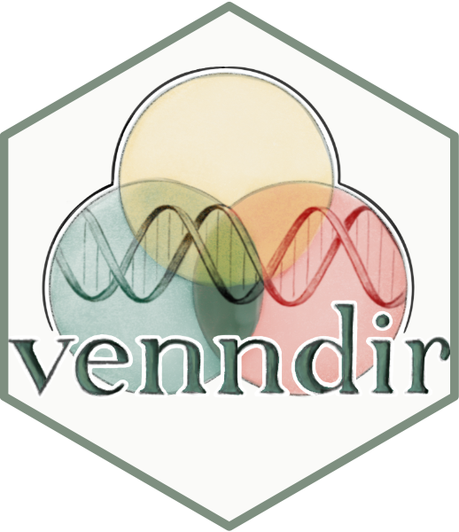

--- 
title: "Venndir Book"
author: "James M. Ward"
date: "`r Sys.Date()`"
site: bookdown::bookdown_site
output: bookdown::gitbook
output_dir: "docs"
documentclass: book
bibliography: [packages.bib, papers.bib]
biblio-style: apalike
link-citations: yes
github-repo: jmw86069/venndir-book
description: "Venn Diagrams with Directionality"
favicon: "images/favicon.ico"
cover-image: images/venndir-cover.png
links-as-notes: true
colorlinks: true
hidelinks: false
monofontoptions: "Scale=0.7"
header-includes:
  - \usepackage{fontspec}
  - \setmonofont{Monaco}
  - \raggedbottom
  - \raggedright
---

```{r placeholder, eval=FALSE, include=FALSE}
  # - \setmainfont{Arial Unicode MS}

  # - \setmainfont{Arial Unicode MS}[
  #     ItalicFont={Arial Unicode MS},
  #     BoldFont={Arial Unicode MS}
  #   ]

```

```{r setup, include=FALSE}
# url: https://jmw86069.github.com/venndir-book
knitr::opts_chunk$set(
   # fig.retina = 2,
   out.width='80%',
   fig.width=10,
   fig.height=8
)
options(knitr.kable.NA='',
   kableEtxra.latex.load_packages=FALSE)
```

```{r setup-2, include=FALSE}
suppressPackageStartupMessages(library(venndir))
suppressPackageStartupMessages(library(patchwork))
#
# automatically create a bib database for R packages
knitr::write_bib(
   c(.packages(),
      'bookdown', 'knitr', 'rmarkdown', 'marquee', 'jamba',
      'limma', 'DESeq2', 'systemfonts', 'gridGeometry', 'grid',
      'polyclip', 'gridExtra', 'eulerr', 'gtable',
      'colorjam', 'patchwork'
   ), 'packages.bib')
```


# Preface {.unnumbered .unlisted}

`r if (knitr::is_latex_output()) '

\\vspace{-1.5em}
\\begin{wrapfigure}{r}{0.25\\textwidth}
  \\vspace{-3.5em} % fine-tune vertical alignment
    \\includegraphics[width=0.23\\textwidth]{images/venndir-hexsticker.png}
\\end{wrapfigure}
'`




```{r hexsticker, echo=FALSE, out.width="30%"}
# fig.width=3, fig.height=3.3
# 

## removed from chunk options since it caused errors knitting to pdf
# out.extra='style="float:right; padding:10px"'

## removed from header but could be added when cover image,
## or some suitable alternative, is available
# cover-image: path to the social sharing image like images/cover.jpg

## For reference: serve the book for realtime updates while editing
# bookdown::serve_book()
```

This book describes the `venndir` [R package](#r-package),
intended for the display
[Venn diagrams](#venn-diagram) with directionality using [R](#r).
These visualizations are the product
of many years creating Venn diagrams, and incorporating feedback and
suggestions from many fantastic colleagues.

`r if (knitr::is_latex_output()) '

\\par\\noindent\\hspace{0pt}\\vspace{1em}
'`

## Does the world need another Venn tool? {-}

You may think the world has enough Venn.  
Venndir boldly suggests there is room for more,  
with arrows and a point to make.


### Some gene sets don’t just overlap—they *lean in.* {-}

This book illustrates the need for directionality in a Venn diagram,
particularly for biological data where genes are often the basis for comparison.
In the study of genes and their effects,
change isn't just a matter of up or down --
it can signify sickness or health, disease or cure, even life or death.


### The arrows aren't just decorative, they're judgmental. {-}

It is quietly satisfying when Venndir reveals that two sets,
although overlapping, are moving in different directions, surfacing
inconsistencies that might otherwise be missed.
It's a reminder that clarity doesn't just come from what overlaps,
but from how things move together.


### Visualize with purpose. Annotate with direction. {-}

One of the most challenging parts of making a Venn diagram is
placing the labels.  
Who knew?  
Venndir provides many techniques to position labels, customize colors,
fonts, and lines; even insert images or other graphics.
It handles a lot of text font quirks so you can avoid the hassle,
and focus on how Venndir renders.


### Putting *‘What is that again?’* to rest, one label at a time. {-}

Perhaps the most surprising 'favorite feature' in Venndir
is its ability to display items inside the Venn diagram.
The best data visualizations anticipate the next question,
and most often it is simply:  
*‘What are those?’*


### Inspired by curiosity, designed for clarity, sharpened by use. {-}

Venndir exists because I really enjoyed the process of creating it.
Many of the features were born of random ideas that grew into
challenges to see if it could be done. The idea list is still
impossibly long, and that gives me great joy.

There were many pitfalls on the road to creating Venndir --
many lessons learned, many helpful suggestions, and many advances by
other incredible [R packages](#r-package).

Venndir came together from many pitfalls, learned lessons,
shared insights, and new capabilities.
The aim was to create a clear first figure with immediate insight,
then offer enough customizations to evolve into a great final figure.
Venndir has met these goals, and so here we are.


## Supporting Tools {-}

As with most [R packages](#r-package), none of this capability
would be possible without the many foundational libraries upon
which Venndir was built.

### Graphics {-}

The graphics system used by Venndir is **grid**, a core R package that
empowers reliable calculation of figure units, metrics, font placement,
and dynamic updating of a figure upon resizing.

The supporting extension **gridGeometry** [@R-gridGeometry] enables
inner and outer borders which will be discussed at length in the
advanced customization topics.

Similarly **gridExtra** [@R-gridExtra] brings the ability to
create a nice table legend, which has become an essential
default feature of Venndir.

Venndir manipulates polygons primarily through
**polyclip** [@R-polyclip], which enables geometry calculations including
[intersection](#intersection),
[union](#union),
[subtraction](#subtraction),
and [buffer region](#buffer-region).

Proportional [Euler diagrams](#euler-diagram) are made possible by
**eulerr** [@R-eulerr], which performs the hard work of
predicting the best available alignment between Venn counts
and geometry.


### Fonts and Labels {-}

A large part of Venndir focuses on labeling, which necessarily
involves detailed control over fonts, glyphs, and assembling
multiple label components together into a group.

The **marquee** [@R-marquee] package provides methods to place text,
replacing previous methods in part due to its use of
**systemfonts** [@R-systemfonts] for font and glyph substitutions.
Without these features, Venndir encountered too many scenarios
where the font, symbol, or glyph would be incorrect
due to the specific computing architecture, character locale,
or output graphics device.
Most such scenarios are resolved by using **systemfonts**,
while **marquee** adds substantial flexibility with
its support of markdown formatting.

Venndir count labels are often comprised of several pieces, and
**gtable** [@R-gtable] enables grouping them into one
graphical object.

Venndir is a refined set of methods that fuses these amazing
tools together into one uniquely powerful package.


```{r 00-todo, eval=FALSE, include=FALSE}
## Todo

# * Consider mentioning similar works? Perhaps not here.

```
