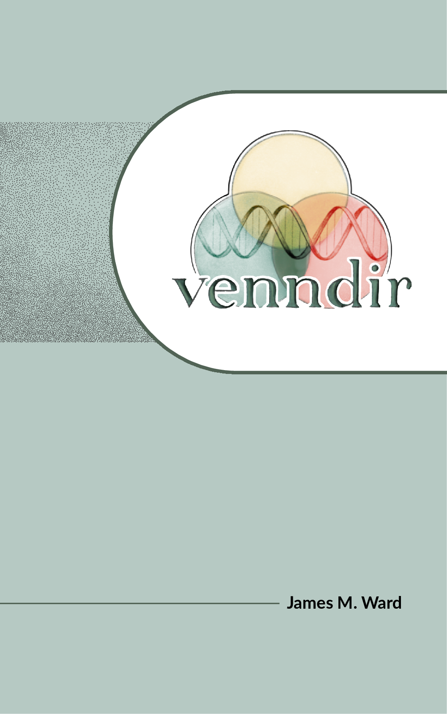
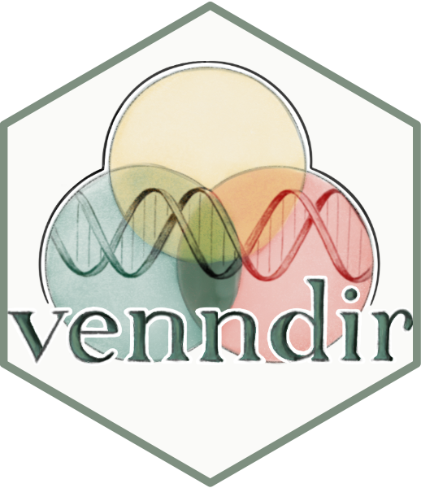

--- 
title: "Venndir Book"
description: "Venn Diagrams with Directionality"
author: "James M. Ward"
orcid: "0000-0002-9510-2848"
favicon: "images/favicon.ico"
cover-image: "images/venndir-cover.png"
cover-image-alt: "Venndir: Venn Diagrams with Directionality"
apple-touch-icon: 
date: "`r Sys.Date()`"
edition: "First Edition"
version: "v0.3.0"
site: bookdown::bookdown_site
output: bookdown::gitbook
output_dir: "docs"
documentclass: book
bibliography: [citations/packages.bib, citations/papers.bib]
biblio-style: apalike
link-citations: yes
github-repo: jmw86069/venndir-book
url: https://jmw86069.github.com/venndir-book
links-as-notes: true
colorlinks: true
graphics: yes
hidelinks: false
monofontoptions: "Scale=0.7"
header-includes:
  - \usepackage{fontspec}
  - \setmonofont{Monaco}[Scale=0.8]
  - \raggedbottom
  - \raggedright
---

```{r placeholder, eval=FALSE, include=FALSE}
  # - \setmainfont{Arial Unicode MS}

  # - \setmainfont{Arial Unicode MS}[
  #     ItalicFont={Arial Unicode MS},
  #     BoldFont={Arial Unicode MS}
  #   ]

```

```{r setup, include=FALSE}
# url: https://jmw86069.github.com/venndir-book
knitr::opts_chunk$set(
   # fig.retina = 2,
   cache=TRUE,
   cache.lazy=FALSE,
   cache.extra=list(
      "cache_key_3"
   ),
   width=if (knitr::pandoc_to() == "epub3") 50 else 80,
   out.width='80%',
   fig.width=7,
   fig.height=5
)
options(knitr.kable.NA='',
   kableEtxra.latex.load_packages=FALSE)
```

```{r setup-2, include=FALSE}
suppressPackageStartupMessages(library(venndir))
suppressPackageStartupMessages(library(patchwork))
```

```{r setup-3, include=FALSE}
# automatically create a bib database for R packages
knitr::write_bib(
   c(.packages(),
      'bookdown', 'knitr', 'rmarkdown', 'marquee', 'jamba',
      'limma', 'DESeq2', 'systemfonts', 'gridGeometry', 'grid',
      'polyclip', 'gridExtra', 'eulerr', 'gtable',
      'colorjam', 'patchwork'
   ), 'citations/packages.bib')
```

```{r kable_fns, echo=FALSE, include=FALSE}
# kableExtra compatibility for epub3 output
# requires bootstrap, custom lines in style.css
if (knitr::pandoc_to() == "epub3") {
   options("kableExtra.html.bsTable"=TRUE)
}

epub_kdf <- function(kdf){
   if (length(kdf) == 0) {
      return(kdf)
   }
   if (!inherits(kdf, "knitr_kable")) {
      return(kdf)
   }
   if (knitr::pandoc_to() == "epub3") {
      kdf <- kdf |>
         kableExtra::kable_styling(
            c("striped", "condensed", "bordered"),
            latex_options="striped",
            full_width=FALSE)
   }
   kdf
}
```

# Preface {.unnumbered}

`r if (knitr::is_latex_output()) '

\\vspace{-1.5em}
\\begin{wrapfigure}{r}{0.40\\textwidth}
  \\vspace{-3.5em} % fine-tune vertical alignment
    \\includegraphics[width=0.40\\textwidth]{images/venndir-cover.png}
\\end{wrapfigure}
'`




```{r hexsticker, echo=FALSE, out.width="30%"}
# fig.width=3, fig.height=3.3
# 

## removed from chunk options since it caused errors knitting to pdf
# out.extra='style="float:right; padding:10px"'

## removed from header but could be added when cover image,
## or some suitable alternative, is available
# cover-image: path to the social sharing image like images/cover.jpg

## For reference: serve the book for realtime updates while editing
# bookdown::serve_book()
```

This book describes the `venndir` [R package](#r-package),
intended for the display
[Venn diagrams](#venn-diagram) with directionality using [R](#r).
These visualizations reflect many years developing Venn diagrams,
refining features like directional arrows, and integrating the
thoughtful suggestions and shared wisdom of many brilliant colleagues.


`r if (knitr::is_latex_output()) '

\\par\\noindent\\hspace{0pt}\\vspace{1em}
'`

## Does the world need another Venn tool? {.unnumbered}

You may think the world has enough Venn.  
Venndir boldly suggests there is room for more,  
with arrows, labels, and points to make.


### Venndir is customizable {-}

In fact, Venndir enables some of the most customizable Venn and Euler
diagrams available, short of using a graphics design tool.
Set labels, fonts, borders, colors, placement, highlights, and item labels,
are all customizable when needed.
Text labels even support Markdown, and with robust Unicode character rendering.

That said, Venndir aims to deliver publication-ready figures, as closely as
possible, using default settings. But still, they're still just Venn diagrams.


### Directionality is important {-}

This book focuses on the techniques used to create Venn diagrams,
including the use of directionality where appropriate.
The need to indicate directionality depends on the questions asked
and the conclusions one hopes to draw from the figure.

\@ref(seehawer-kmt2-gene-venns) [Seehawer Kmt2 Gene Venns]
Examples such as Section 5 illustrate a common pattern:
They tested only the items showing [concordance](#concordance),
agreement in direction, then interpreted the findings without
evaluating discordance at all.

Without also evaluating the discordance, they lacked the proper context to
interpret the results.

Conclusions drawn when testing only concordance, without also assessing
discordance, are inherently biased, with limited validity of interpretation.

In the study of genes and their effects, change is more than just
up or down -- it can signify sickness or health, disease or cure,
even life or death.


### The arrows aren't just decorative, they're insightful {-}

It is quietly satisfying when Venndir illustrates that although two sets
my overlap, they are moving in different directions -- revealing
inconsistencies that may otherwise be missed.
Clarity doesn't just come from what overlaps, but from how things
move together.


### Visualize with purpose. Annotate with direction. {-}

One of the most challenging components in Venndir is placing the labels.  
Who knew?  
Venndir automates the job of placing labels inside or outside the Venn circles,
then allows you to nudge, style, highlight, and customize.

Together with **marquee** [@R-marquee], Venndir provides robust support for
custom fonts across all graphics devices, with Unicode character substitution,
Markdown and inline styling, and ability to embed images or other graphics.

Venndir figures use **grid** graphics, are compatible with
**patchwork** [@R-patchwork] for multi-panel figures, and can be customized
down to the level of **grid** graphics objects (grobs).


### Put *‘What are those?’* to rest, one label at a time. {-}

One of the most unexpectedly fun features in Venndir is
the ability to display item names inside the figure.
The best data visualizations anticipate and answer that "next question."  
For a Venn diagram it is most often:

*‘What are those?’*


### Inspired by curiosity, designed for clarity, sharpened by use. {-}

Venndir exists mostly because I thoroughly enjoyed creating it.
It touches many interesting aspects of algorithm development,
problem solving, data visualization design, and the practical driver
of publication.
It has received substantial feedback, and I always love listening
to new ideas and suggestions.

Yes, there are a lot of labels.  
Yes, the figures can become very busy.  
And yes, I still think the results are useful and necessary.

All that said, Venndir with directionality (see "each" in [Overlap Type])
is a **lot** to look at, and may be most useful *during analysis*.
The final published figure may or may not be simplified for
visual clarity.

My philosophy is to make the figure useful for me before anyone else,
then for my colleagues next, finally polishing it to present to others.
Venndir tries to accomplish that in one step, but failing that it tries
to make it useful for your.

The typical Venndir figure often follows the same progression:
complicated details for me, optimized improvements for colleagues,
then clear and simplified for others.

This book roughly follow the same progression:

* Introduction
* Data Import
* Venndir Basics
* Advanced Customization
* Venn Figures and Case Studies


## Supporting Tools {-}

As with most [R packages](#r-package), none of this capability
would be possible without the many foundational libraries upon
which Venndir was built.

### Graphics {-}

The graphics system used by Venndir is **grid**, a core R package that
empowers reliable calculation of figure units, metrics, font placement,
and dynamic updating of a figure upon resizing.

The supporting extension **gridGeometry** [@R-gridGeometry] enables
inner and outer borders which will be discussed at length in the
advanced customization topics.

Similarly **gridExtra** [@R-gridExtra] brings the ability to
create a nice table legend, which has become an essential
default feature of Venndir.

Venndir manipulates polygons primarily through
**polyclip** [@R-polyclip], which enables geometry calculations including
[intersection](#intersection),
[union](#union),
[subtraction](#subtraction),
and [buffer region](#buffer-region).

Proportional [Euler diagrams](#euler-diagram) are made possible by
**eulerr** [@R-eulerr], which performs the hard work of
predicting the best available alignment between Venn counts
and geometry.


### Fonts and Labels {-}

A large part of Venndir focuses on labeling, which necessarily
involves detailed control over fonts, glyphs, and assembling
multiple label components together into a group.

The **marquee** [@R-marquee] package provides methods to place text,
replacing previous methods in part due to its use of
**systemfonts** [@R-systemfonts] for font and glyph substitutions.
Without these features, Venndir encountered too many scenarios
where the font, symbol, or glyph would be incorrect
due to the specific computing architecture, character locale,
or output graphics device.
Most such scenarios are resolved by using **systemfonts**,
while **marquee** adds substantial flexibility with
its support of markdown formatting.

Venndir count labels are often comprised of several pieces, and
**gtable** [@R-gtable] enables grouping them into one
graphical object.

Venndir is a refined set of methods that fuses these amazing
tools together into one uniquely powerful package.


```{r 00-todo, eval=FALSE, include=FALSE}
## Todo

# * Consider mentioning similar works? Perhaps not here.

```
